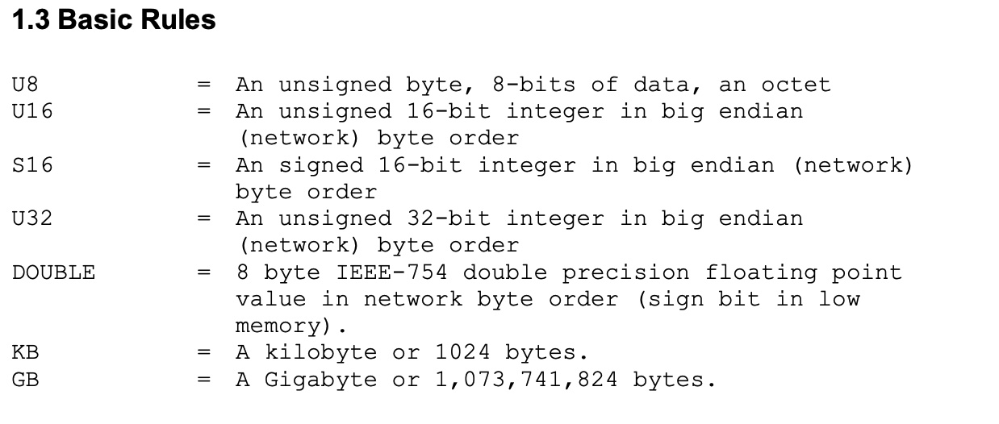
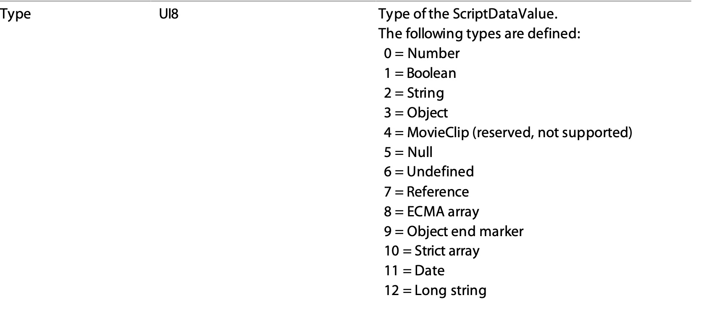
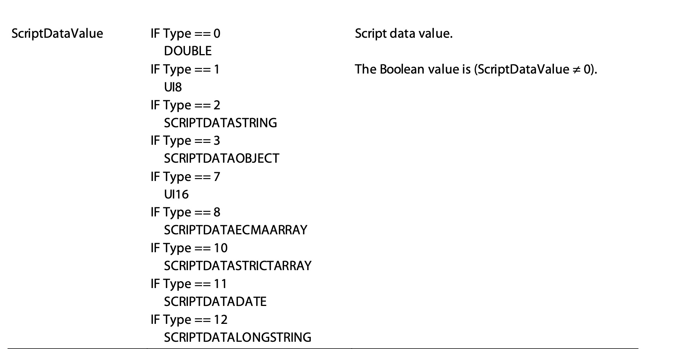
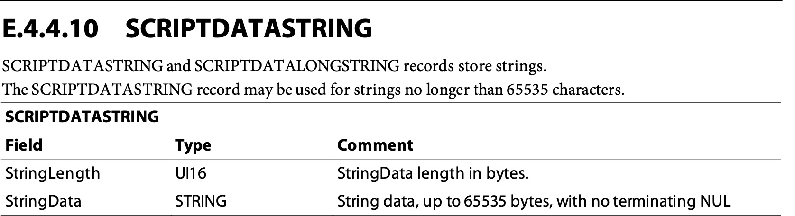
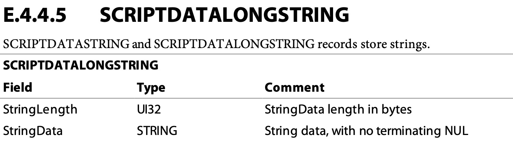
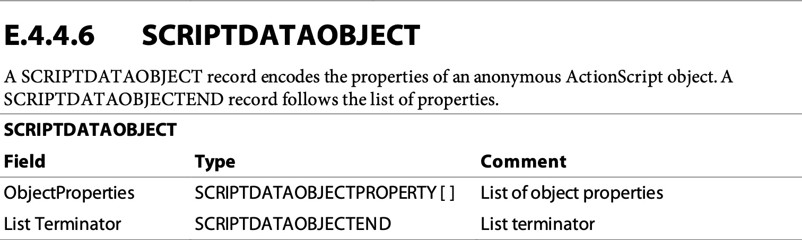
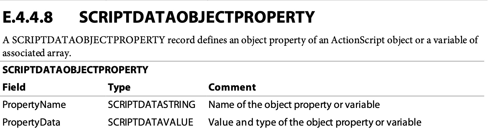
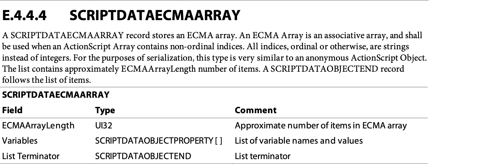
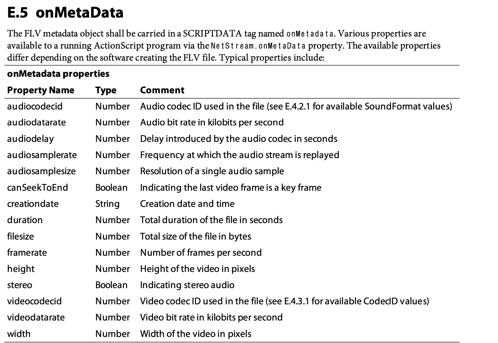

# Action Message Format - AMF 0

参考： [Action Message Format - AMF 0](https://rtmp.veriskope.com/pdf/amf0-file-format-specification.pdf)

注意大小端模式

## 数据表示

Type + Value

- 数值类型， 用 double 来表示， 格式： type + double
- bool 类型，用一个字节来表示， 格式： type + bool
- string类型
    - 短 string， type + UI16 length + content
    - 长 string， type + UI32 length + content
- object 类型
    - type + properties list + obj_end
- ecma array
    - type + array length + properties list + obj_end
- property, name + value
    - name: string, 此时明确是 string，不需要添加类型了
    - value： amf value

### string

length + stringData, 分为 short string 和 long string， 区别是长度
- short string, 长度是 UI16
- long string，长度是 UI32

string data 不包含字符串结尾 NUL。

### object

properties + obj_end, 其中 properties 是 name (string) + data (amf_value) 的组合.

obj_end 为三个字节，内容是 `[0, 0, 9]`.

### ecma array 

array count + properties + obj_end, 其中 

array count 是 UI32 类型的大端表示。

properties 是 name (string) + data (amf_value) 的组合.

obj_end 为三个字节，内容是 `[0, 0, 9]`.

## FLV onMetaData

结构： name + ecma array

