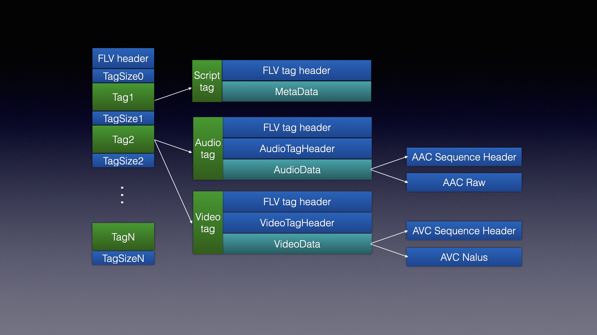
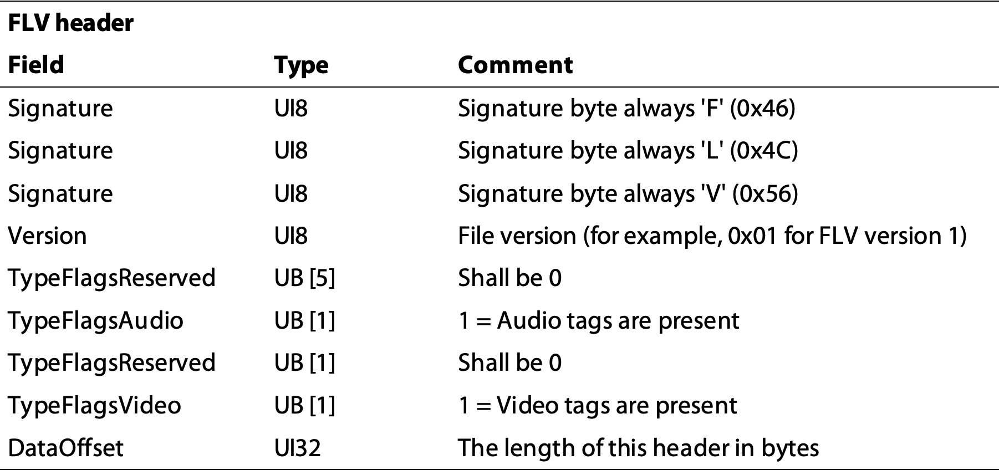
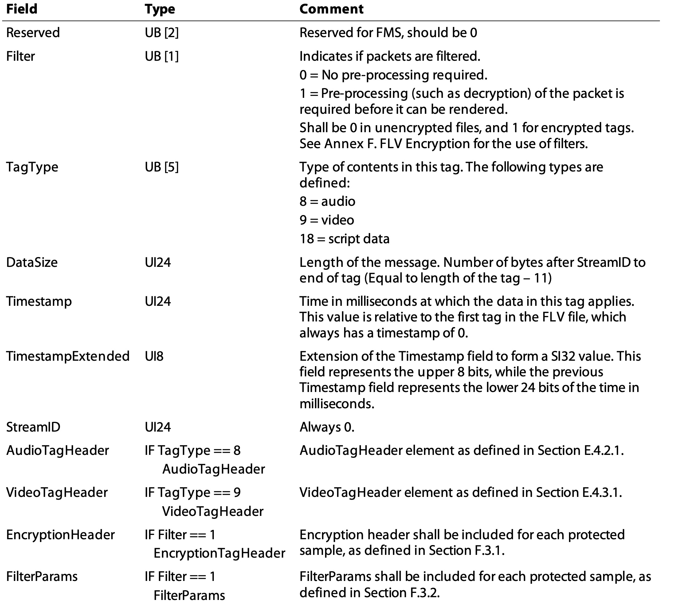
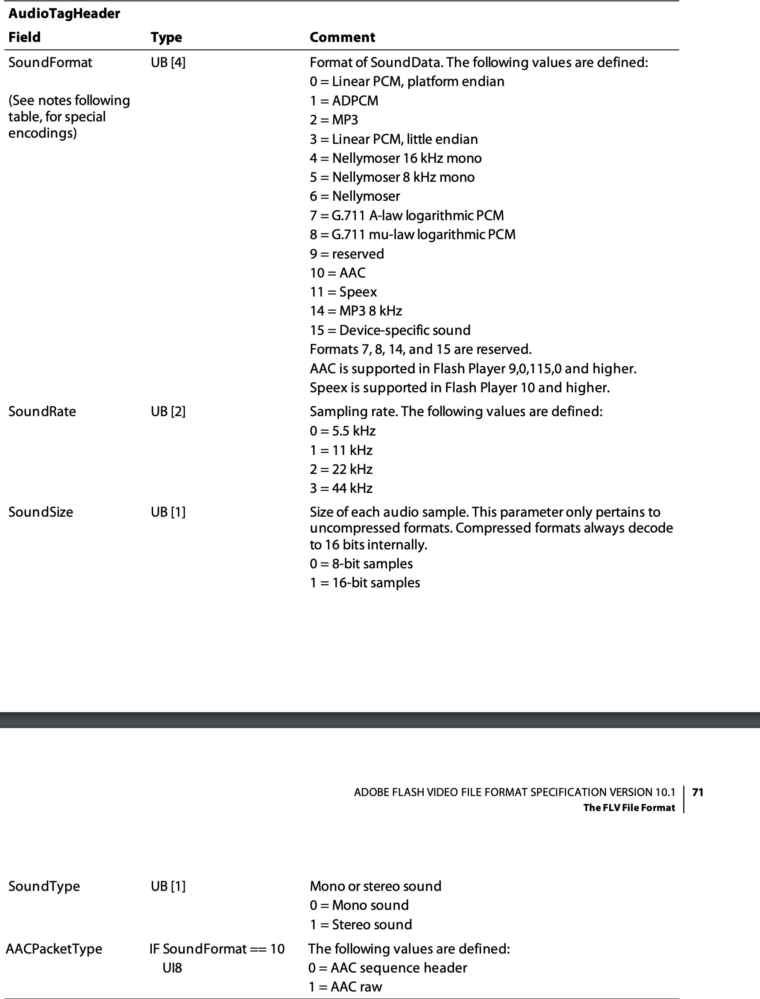
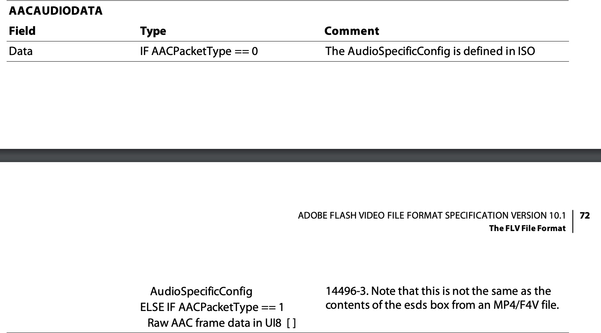
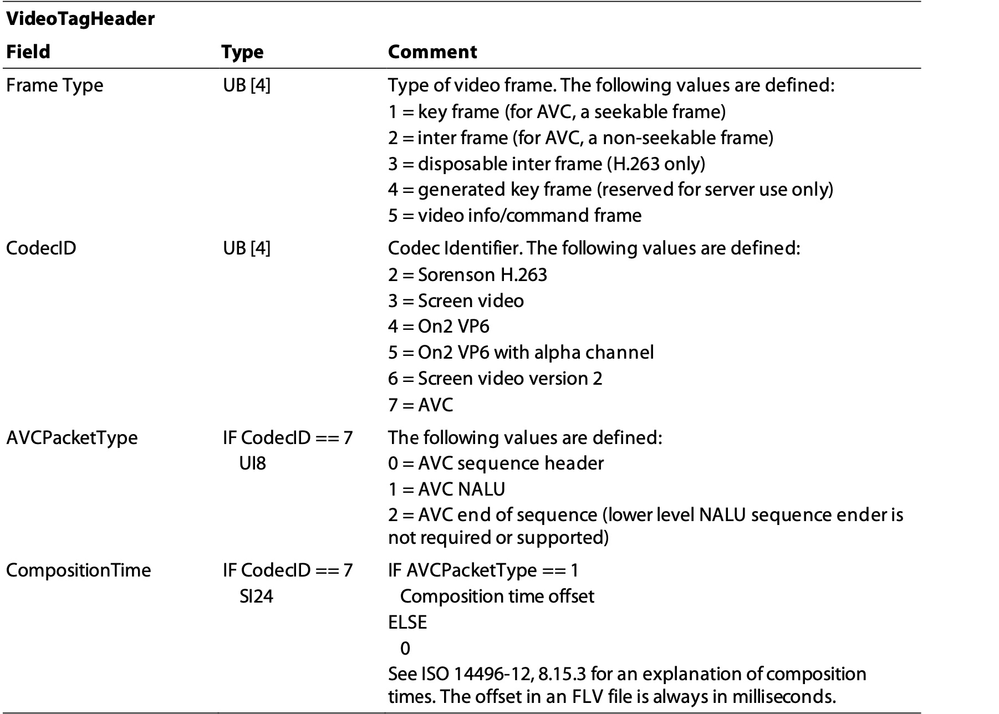
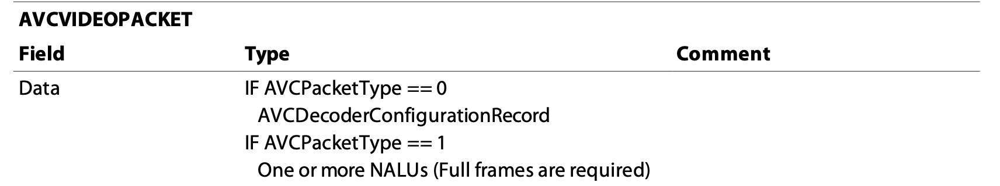
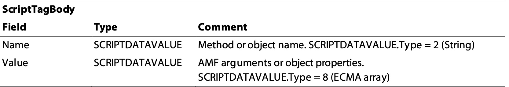
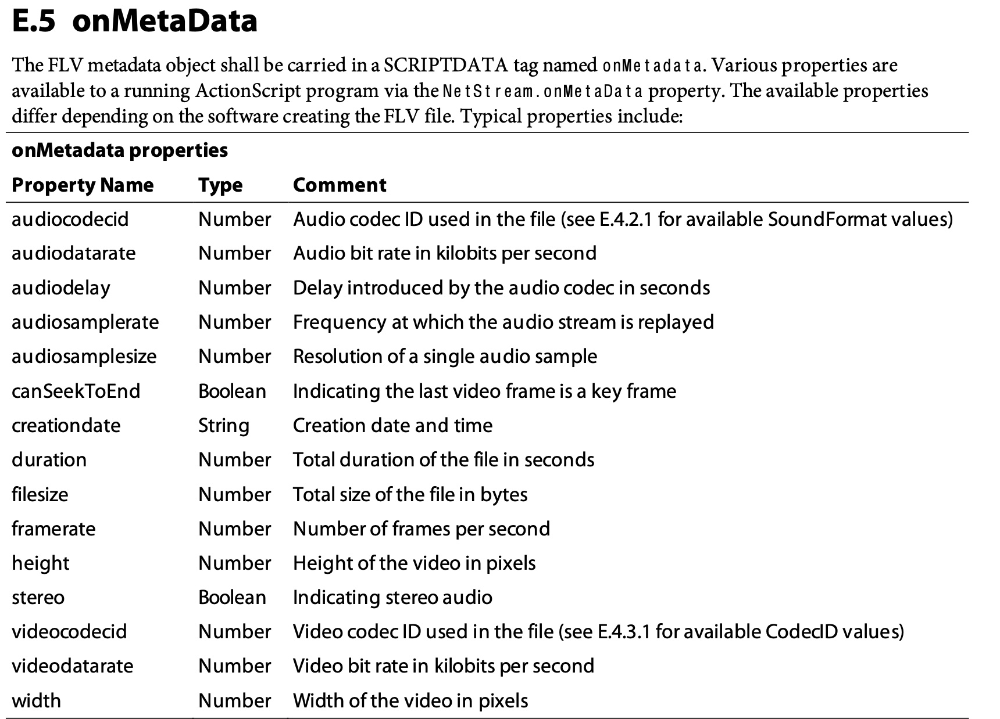

# FLV File Format
refer to: [The FLV File Format](https://ossrs.io/lts/en-us/assets/files/flv_v10_1-5244d3059e5425eb03a15eb24537bd59.pdf)


明确大小端， FLV 对数值使用大端存储。

> FLV files shall store multi-byte numbers in big-endian byte order. For example, as a UI16 in
SWF file format, the byte sequence that represents the number 300 (0x12C) is 0x2C 0x01; as a UI16 in FLV file
format, the byte sequence that represents the number 300 is 0x01 0x2C. 


## flv file structure



## FLV header



- 前三个字节是 FLV， 
- 后面紧接着是版本号， 对 FLV version 1, 是 1
- TypeFlagsAudio:  是否有音频
- TypeFlagsVideo:  是否有视频
- DataOffset: FLV header 的大小， 9 字节


## FLV Tag Header



- Filter: 是否需要前置处理，例如解密。 1 需要， 0 不需要
- TagType:  
    - 8 audio
    - 9 video
    - 18 script data
- DataSize: 
    - UI24, 24 位的无符号整数，以大端形式写入存储。
    - 从 StreamID 之后到 Tag 结束的内容的大小。等于 `TagSize - 11`, 而 FLV Tag Header 占 11 个字节。
- Timestamp： 
    - 与 TimestampExtended 构成一个 SI32 (有符号整数) 的时间戳，存储 低 24 位， 大端模式
    - 单位毫秒， 表示于 第一个 tag 时间戳的偏移，第一个 tag 的时间戳总是 0.
- TimestampExtended：
    - 与 Timestamp 构成一个 SI32 (有符号整数) 的时间戳，存储高 8 位
- StreamID： 24bit 总是 0


## AudioTagHeader





 - SoundFormat:  编码类型，AAC = 10
 - SoundRate： 采样率， 对 AAC 总是 44KHZ
 - SoundSize： 采样精度，压缩类型都是 16 bits
 - SoundType： 声道类型，对 AAC 总是 Stereo Sound
 - AACPacketType： 
    - 0 = AAC sequence header
    - 1 = AAC raw


> If the SoundFormat indicates AAC, the SoundType should be 1 (stereo) and the SoundRate should be 3 (44 kHz).
However, this does not mean that AAC audio in FLV is always stereo, 44 kHz data. Instead, the Flash Player ignores
these values and extracts the channel and sample rate data is encoded in the AAC bit stream.

## AACAUDIODATA



`AACPacketType = 0`, 内容是 AudioSpecificConfig， 定义在 ISO 134496-3 中。
`AACPacketType == 1`, 内容是 AAC adts 数据帧。


关于 AudioSpecificConfig， 参考 [ISO14496-3-2009.pdf](https://csclub.uwaterloo.ca/~ehashman/ISO14496-3-2009.pdf)

```
/**
 * @brief AAC AudioSpecificConfig
 * Refer to ISO 14496-3-2009. 2 bytes when write to file.
 */
struct AudioSpecificConfig {

    /*
    AAC_Main        = 1,
    AAC_LC          = 2,
    AAC_SSR         = 3,
    AAC_LTP         = 4,
    AAC_Scalable    = 6,
    ER_AAC_LC       = 17,
    ER_AAC_LTP      = 19,
    ER_AAC_Scalable = 20,
    ER_AAC_LD       = 23,
     */
    uint32_t audioObjectType : 5;
    uint32_t samplingFrequencyIndex : 4;
    uint32_t channelConfiguration : 4;
    // GASpecificConfig()
    struct
    {
        /*
        For all General Audio Object Types except AAC SSR and ER AAC LD:
        If set to “0” a 1024/128 lines IMDCT is used and frameLength is set to 1024, if set to “1” a 960/120 line IMDCT is used and frameLength is set to 960.
        For ER AAC LD:
        If set to “0” a 512 lines IMDCT is used and frameLength is set to 512, if set to “1” a 480 line IMDCT is used and frameLength is set to 480.
        For AAC SSR:
        Must be set to “0”. A 256/32 lines IMDCT is used. Note: The actual number of lines for the IMDCT (first or second value) is distinguished by the value of window_sequence.

        So set 0 for aac-lc.
         */
        uint32_t frameLengthFlag : 1;
        /* does not depend on core coder, set 0 */
        uint32_t dependsOnCoreCoder : 1;
        /* is not extension, set 0 */
        uint32_t extensionFlag : 1;
    };
    AudioSpecificConfig() = default;
    AudioSpecificConfig( uint8_t adts_header_buf[7] );
    void to_buf( uint8_t buf[2] );
};
```

对应的内容，可以从 [AAC ADTS](https://wiki.multimedia.cx/index.php/ADTS) header 中解出。


## VideoTagHeader


- Frame Type: 帧的类型
    - 1 = key frame (for AVC, a seekable frame)
    - 2 = inter frame (for AVC, a non-seekable frame)
    - 3 = disposable inter frame (H.263 only)
    - 4 = generated key frame (reserved for server use only) 5 = video info/command frame
- CodecID： 编码类型
    - 2 = Sorenson H.263
    - 3 = Screen video
    - 4 = On2 VP6
    - 5 = On2 VP6 with alpha channel 6 = Screen video version 2
    - 7 = AVC
- AVCPacketType：h264 数据包类型
    - 0 = AVC sequence header
    - 1 = AVC NALU
    - 2 = AVC end of sequence (lower level NALU sequence ender is not required or supported)
- CompositionTime：
    - 考虑到有 B 帧的情况， `pts ！= dts`, flv_tag_header 中保存的是 dts， 这个表示 `pts-dts`的差值。


## AVCVIDEOPACKET



- `AVCPacketType == 0`, 存储的是 AVCDecoderConfigurationRecord， 定义在 ISO 14496-15, 5.2.4.1
- AVCPacketType == 1, 存储的是一帧的 NALUS，格式是 4 bytes lenght + nalu, 区别于 Annex-B 的 H264 格式， startcode(00, 00, 00, 01) + nalu

### AVCDecoderConfigurationRecord

```
/*
ISO/IEC 14496-15:2010(E) 5.2.4.1.1 Syntax (p16)

aligned(8) class AVCDecoderConfigurationRecord {
    unsigned int(8) configurationVersion = 1;
    unsigned int(8) AVCProfileIndication;
    unsigned int(8) profile_compatibility;
    unsigned int(8) AVCLevelIndication;
    bit(6) reserved = '111111'b;
    unsigned int(2) lengthSizeMinusOne;
    bit(3) reserved = '111'b;

    unsigned int(5) numOfSequenceParameterSets;
    for (i=0; i< numOfSequenceParameterSets; i++) {
        unsigned int(16) sequenceParameterSetLength ;
        bit(8*sequenceParameterSetLength) sequenceParameterSetNALUnit;
    }

    unsigned int(8) numOfPictureParameterSets;
    for (i=0; i< numOfPictureParameterSets; i++) {
        unsigned int(16) pictureParameterSetLength;
        bit(8*pictureParameterSetLength) pictureParameterSetNALUnit;
    }

    if( profile_idc == 100 || profile_idc == 110 ||
        profile_idc == 122 || profile_idc == 144 )
    {
        bit(6) reserved = '111111'b;
        unsigned int(2) chroma_format;
        bit(5) reserved = '11111'b;
        unsigned int(3) bit_depth_luma_minus8;
        bit(5) reserved = '11111'b;
        unsigned int(3) bit_depth_chroma_minus8;
        unsigned int(8) numOfSequenceParameterSetExt;
        for (i=0; i< numOfSequenceParameterSetExt; i++) {
            unsigned int(16) sequenceParameterSetExtLength;
            bit(8*sequenceParameterSetExtLength) sequenceParameterSetExtNALUnit;
        }
    }
}
*/
```

上面的内容可以通过解析 sps 得到， 关于多个 sps， pps 的情况，目前还未遇到， 所以一般只处理了一个的情况。

## SCRIPTDATA

> A SCRIPTDATAVALUE record contains a typed ActionScript value.

 参考： [ActionScript](./ActionScript.md)



name + value, 其中 name 是 string， value 是 ecma array.


关于 FLV 中的 scrip data，主要用来存储文件的元数据



- name： onMetadata
- value： ecma array, key 可是是上面列举的一些


    


